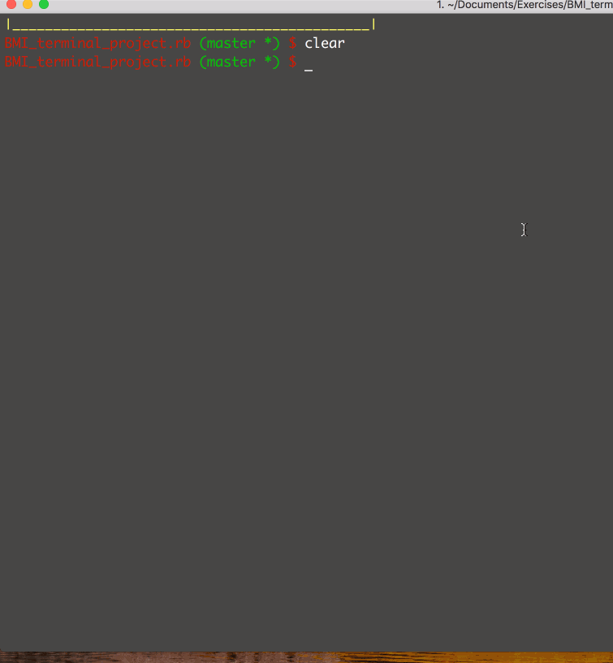

## About the Project

Body mass index, or **BMI**, is used to determine whether you are in a healthy weight range for your height.

## What’s BMI?

BMI compares your weight to your height, and is calculated by dividing your weight (in kilograms) by your height (in metres squared). It gives you an idea of whether you’re 'underweight', a 'healthy' weight, 'overweight', or 'obese' for your height. BMI is one type of tool to help health professionals assess the risk for chronic disease.

This project aim to provide a terminal based BMI calculator.

## Setup on Local Machine!

- `git clone git@github.com:ismatfarjana/bmi_terminal_app.git`
- `cd bmi_terminal_app`
- run `bundle install`

## How to use

- `cd bmi_terminal_app`
- `ruby bmicountterminalapp.rb`
- Provide your Weight in kg
- Provide your Height in cm

## Algorithm used

``` BMI = kg / m^2 ```

## Demo



## Improvement

- [] Considering **Gender** and **Age**
- [] Provide weight management plan based on **BMI**
- [] Provide Diet plan
- [] Improve on design
